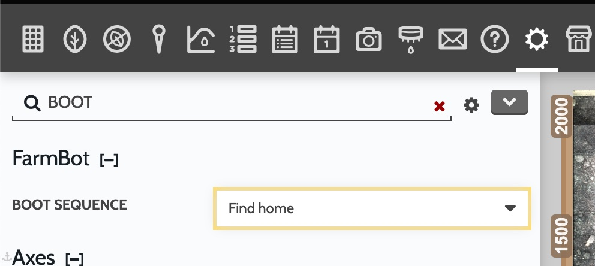

# Find Home At Boot

## Target

Express users with Z axis stall problems who want to validate home location at system boot.

## Setting up a `Find Home at Boot` sequence:

Create a `Lua` step with the code [find_home_boot](./find_home_boot.lua)
You _may_ want to edit the line which sets the stall level:

```lua
    -- Hardcoded variables so that this works with the `BOOT SEQUENCE` setting
    local zStallMax = '70' -- stall level
```

## Using

You can now use this sequence in the `BOOT SEQENCE` setting



Note:

You must initially disable stall detection manually, as [recommended](https://express.farm.bot/v1.1/extras/troubleshooting/z-axis-movements.html) for most operations. X and Y stall detection will be enabled.


## Motivation

### Limitations

- [Z axis stalling](https://forum.farmbot.org/t/z-axis-issues-express-heavy-fall-stuttering-stalls/7258/6)
- [Can not use nested sequences on groups](https://forum.farmbot.org/t/nested-sequences-and-plant-groups/7247/13)
- `env` values last between reboots and are shared between sequences

### Solution


Sequence which:
- Programatically enables stall detection on the Z axis and sets the level
- Runs `Find home` operations on all axises
- Disables stall detections so other operations can continue as normal
