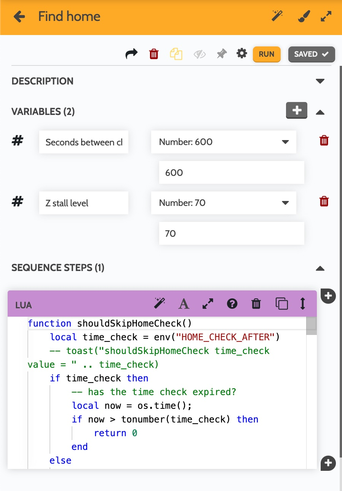

# Find Home Periodically

## Target

Express users with Z axis stall problems who want to validate home location
before/during running events.

## Setting up the sequence:

### Variables for the sequence

- `Seconds between checks` number variable
- `Z stall level` number, I'm using `70`

### Code

Create a `Lua` step with the code [find_home_periodically](./find_home_periodically.lua)

## Motivation

### Limitations

- [Z axis stalling](https://forum.farmbot.org/t/z-axis-issues-express-heavy-fall-stuttering-stalls/7258/6)
- [Can not use nested sequences on groups](https://forum.farmbot.org/t/nested-sequences-and-plant-groups/7247/13)
- `env` values last between reboots and are shared between sequences

### Solution

Start: Disable stall detection manually, as [recommended](https://express.farm.bot/v1.1/extras/troubleshooting/z-axis-movements.html) for most operations

Sequence which:
- Programatically enables stall detection on the Z axis and sets the level
- Runs `Find home` operations on all axises
- Disables stall detections so other operations can continue as normal

Controlling how often to run:
- Because you can not create [nested sequences](https://forum.farmbot.org/t/nested-sequences-and-plant-groups/7247/13) where a command is only run in the outer loop once this uses a time check to determin how often to recalibrate `home`.

### Additional notes

- See also [Fnd home at boot](../find_home_boot/)
- I keep `z axis` motor engaged at all times